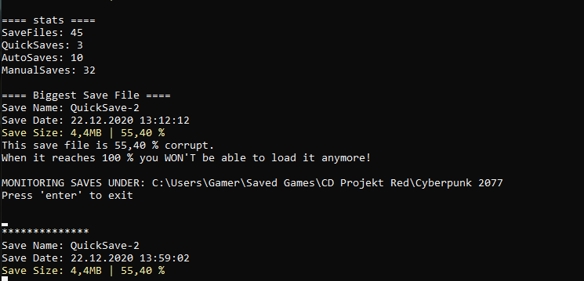

# CyberPunk 2077 SaveFileWatcher

## UPDATE
Looks like the issue has been fixed and this tool is obsolete: https://www.cyberpunk.net/en/news/37214/hotfix-1-06  
Maybe ill keep it running anyways to see when my savegame would had been corrupted ^^  

checks your CyberPunk 2077 save files for size to make sure they won't corrupt.  
It will list all your save games with current size and percentage to 8MB. After that it will keep monitoring your save file directory and show in "real time" (there is a delay to make sure the file was written completely) what the state of your newest/latest save is.

There is currently a bug in Cyberpunk 2077 that corrupts your save files when they exceed 8MB (source: https://www.youtube.com/watch?v=If6RgU14hb0).  
This program watches your save files and shows you how much space they already have taken up.  
Current fix (22.12.2020): Sell to drop boxes and not to vendors, clean up your inventory(s) regulary. Basically: DON'T have to many items.

## HOW TO

Download the program exe from over here https://github.com/bison--/CyberpunkSaveFileWatcher/releases/tag/v0.0.2 and run it. Thats all.

